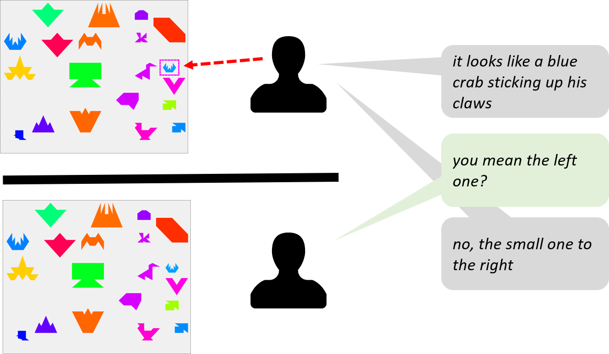

# KTH-Tangrams

KTH Tangrams human-human dialog data set.

You can find more information in the paper:

Todd Shore, Theofronia Androulakaki, Gabriel Skantze (2018). [KTH Tangrams: A Dataset for Research on Alignment and Conceptual Pacts in Task-Oriented Dialogue](https://www.aclweb.org/anthology/L18-1123/). Proceedings of the Eleventh International Conference on Language Resources and Evaluation (LREC 2018).
https://www.aclweb.org/anthology/L18-1123/

Please cite this paper if you use the data. 
